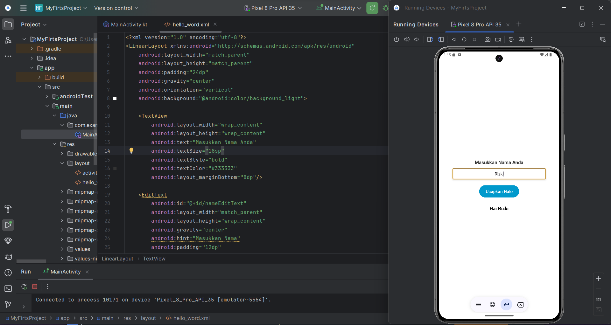

# pm25-week1

## Hasil Program

Membuat sebuah aplikasi sederhana untuk memenuhi tugas mata kuliah pemrograman bergerak yang mana pada aplikasi ini user melakukan input nama dan program akan memproses dan meberikan output "Hallo (Nama)"

